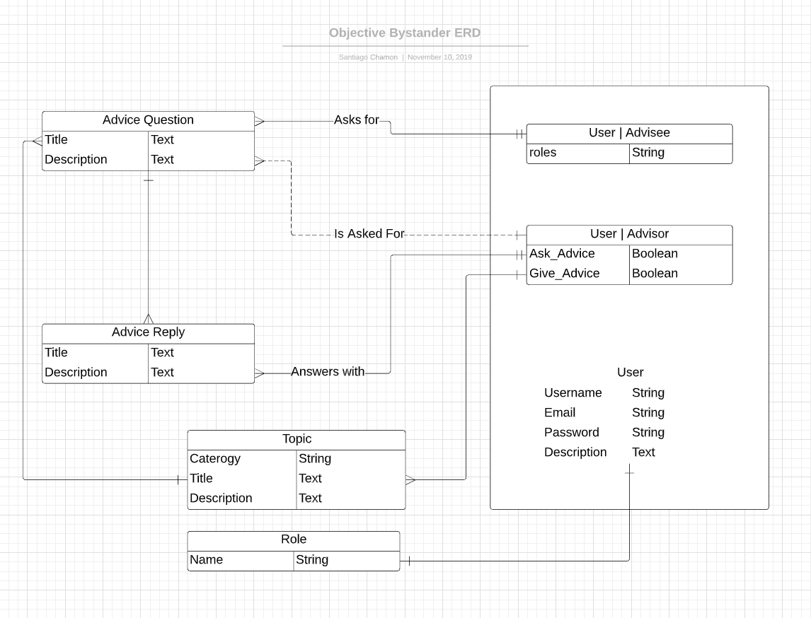
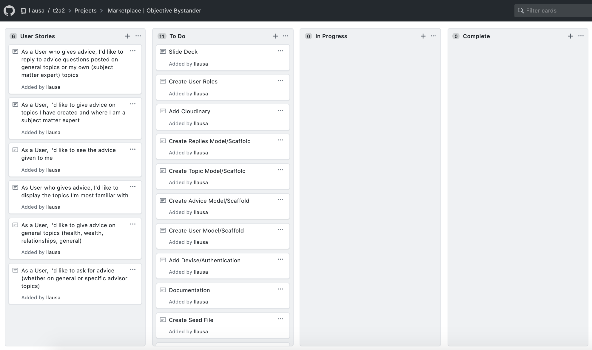
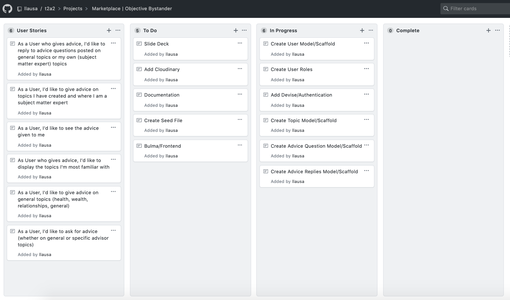
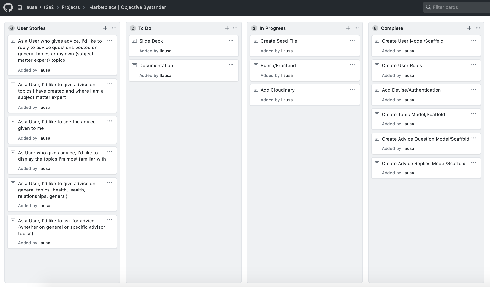
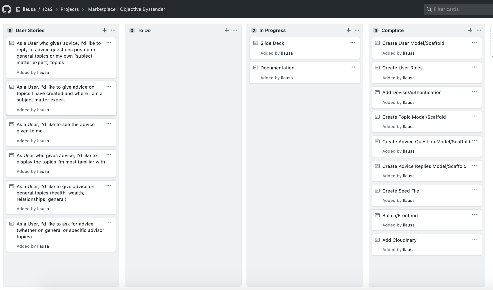

# T2A2 - Marketplace Project

## Status
Completed! Check out the links below to see the project live (objective bystander) or the code base (github)

## The Project can be found here:
- [Github](https://github.com/llausa/t2a2)
- [Objective Bystander](https://fierce-mesa-66953.herokuapp.com/) - Live website

# The Problem
**R7 Identification of the  _problem_  you are trying to solve by building this particular marketplace  _app_.**

When people ask for advice, they are ready to change. However, asking for advice can be complicated and we don't usually want to ask advice from the people around us.

Most of the times, useful advice comes from strangers who are not biased, have no connections to us and are giving us an objective viewpoint without adverse incentives against our long term gain.

**R8 Why is it a  _problem_  that needs solving?**
With the creation of the Internet, there is no at-scale solution that allows people to receive advice based on specific topics, from subject-matter experts.

A lot of knowledgeable people in the world are not sharing their thoughts and perspectives and now it's possible for anyone to unlock that information.

It can now be stored on the Internet and shared with anyone who is asking.

An extension of this product would be to allow advice givers to charge a monthly subscription for their advice (while the platform takes a small cut), with limits placed by the advice giver on how many questions/advice requests can be made by premium users of the specific advice giver.

## The Solution

R11 Description of your marketplace  _app_  (website), including:
- Purpose
	- The purpose of this application is to provide a two-way marketplace that connects subject-matter experts offering advice on specific topics with individuals seeking advice on those topics or on general topics (Health, Wealth, Relationships and General).

- Functionality / features
	- Users will be able to create accounts on the platform and choose to be Advice Givers (Advisors) or Advice Takers (Advisees).
	- Advice Takers (Advisees) will be able to ask questions from specific topics (managed by subject matter experts) or post Advice requests on a one of the four general advice page topics (health, wealth, relationships, general)
	- Advice Givers (Advisors) will be able to respond to questions under the four main topics as well as on topics they have created and feel like they can give advice on. Only the Advisor owners of each topic will be able to answer questions on their topics. Advisees can choose to post questions under these Advisor topics if they feel like the Advisor can help them.

- Sitemap
	- 

- Screenshots of final version
	- [Screenshot 1](docs/screenshot_1.png)
	- [Screenshot 2](docs/screenshot_2.png)
	- [Screenshot 3](docs/screenshot_3.png)
	- [Screenshot 4](docs/screenshot_4.png)
	- [Screenshot 5](docs/screenshot_5.png)

- Target audience
	The primary target audience is anyone looking for advice on Health, Wealth, Relationships or in General as well as topics that are managed by subject matter experts.

	The other primary target audience is advice givers (Advisors) who feel they can contribute with advice on specific topics either under the Health, Wealth, Relationship and General umbrellas or specific topics they specialize in. The idea behind targeting these users is to unlock their experiences at scale and reachable by anyone with an Internet connection.

- Tech stack (e.g. html, css, deployment platform, etc)
	[Ruby on Rails](https://rubyonrails.org/) for Backend
	[PostgresQL](https://www.postgresql.org/) for the Database
	[Bulma](https://bulma.io/) for Frontend
	[Github](https://github.com/) for Version Control
	[Github Projects](https://help.github.com/en/github/managing-your-work-on-github/about-project-boards) for planning and task assignment
	[Heroku](https://www.heroku.com/) for Production Hosting

## User Stories
R12 User stories for your  _app_

User Stories can be found [here](https://github.com/llausa/t2a2/projects/1).

## Wireframes
R13 Wireframes for your  _app_
- [Home page 1 desktop wireframe](docs/desktop_main1.png)

- [Home page 2 desktop wireframe](docs/desktop_main2.png)

- [Home page mobile wireframe](docs/Home_Mobile.png)

- [User profile desktop wireframe](docs/User_Profile_Desktop.png)

- [User profile mobile wireframe](docs/User_Profile_Mobile.png)

- [Topic show with questions desktop wireframe](docs/topic_with_questions_Desktop.png)

- [Topic show with questions mobile wireframe](docs/Advice_Listing_Mobile.png)

## ERD
R14 An ERD for your  _app_

## High-Level Components
R15 Explain the different high-level components (abstractions) in your  _app_

As a marketplace application, Users (advice givers aka advisors and advice takers aka advisees) interact with each other through Topics, Advice Questions and Advice Replies.

An advice taker (aka requesting advice or advisee) can post a request for Advice on any of the advice topics like Health, Wealth, Relationships, General or an Advisor-created topic curated and answered by the advisor who owns that topic.

An Advisor will be able to list out up to 3 topics they have and which advice takers can request advice for.

A User, when creating an account will have to choose to be either an Advisor or an Advisee. These options are mutually exclusive. User usernames will be automaically randomly generated when an account is made and users will use their emails for authentication.

User will have access to their User Profile, where they can edit their profile and see their topics, advice replies or advice questions (depending on their role).

## Third Party Services

R16 Detail any third party services that your  _app_  will use

- Devise
	- Devise is one of the most popular authentication tools for the Ruby on Rails framework. It brings flexible and thorough out-of-the-box authentication functionality. This is taken advantage of in this project to allow modifications necessary to set roles in user creation, as well as random username generation.
- Rolify
	- Roles library gem for the Ruby on Rails framework that creates all of the functionality needed to assign roles to Users and create authorisation throughout the website. Authorisation in this project takes form as displaying specific forms or content to users with different roles. Nearly all main pages on this project use authorisation to some degree.
- Couldinary
	- Cloudinary offers a cloud service for image uploads that is compatible with the Ruby on Rails framework. It is used in this project to allow Users to upload a photo with an advice question if they have the advisee role on their profile.

## Project Models
R17 Describe your projects  _models_  in terms of the relationships (active record associations) they have with each other

User, Topic, Advice Question and Advice Repliy are the main models of this project.

The User model is the primary model in the application. It holds relationships with nearly every other model.

Roles in this app have been created with Rolify, which means they don't have an actual Model but are attached to the Users model through a User Roles table on the database.

A User will have either an _Advisor_ or _Advisee_ role and these will be mutually exclusive. The User model has a one-to-many relationship with the Topic model - meaning that one User object can have many Topics, but this will be capped at 3 specialties.

The Topic model is the schema for the 3 subjects or topics that an Advisor can create and which Advice Takers (aka Advisees) can request advice on specifically (by asking Advice Questions on the topic). Only the topic (a topic will be unique) owner will be able to answer any advice questions in the topic. The Topic model also belongs to the User model.

The User model can have many instances of Advice Questions and many instances of the Advice Replies model. Advice Questions also belong to the Topic model (aka to a Topic object).

A Topic can have many Advice Question objects. And an Advice Questions can have many Advice Replies.

The Advice Reply model belongs to the User model and to the Advice Question model.

All child associations (aka belongs to associations) have a dependent destroy relationship, meaning that for example, if a Topic is deleted by its User (owner), all of the Advice Questions and Advice Replies connected with it will also be deleted.

## DB Relations/Schema
R18 Discuss the database relations to be implemented in your application

R19 Provide your database schema design

## Task Allocation
R20 Describe the way tasks are allocated and tracked in your project

After the creation of User Stories, To Do cards were created to determine all actions needed to be taken in order for the project to begin. The main software used to track all of these actions items was Github Projects through a Kanban methodology. This is what the initial kanban looked like before the project began:

It was then decided that the backend should be completed first as it held the greates value in the project. This decision led to the following In Progress column, with tasks being completed from top to bottom as it reflected the order that App projects needed to be built in:

Here are progress shots:
- [backend progress shot 1](docs/project_3.png)
- [completing backend](docs/project_4.png)

Afterwards, the frontend was the focus as well as the Image uploading functionality. A seed file was also created to hold information so that the site could properly be visualised. Apart from the Image Upload functionality, the front-end design aspect of the project did not hold as much priority as the back-end and was as such left for after the back-end was completed.
Here is what the kanban of the project looked like 2 days before the due date:

The last day before submitting held the creation of the presentation and finalisation of the documentation. The documentation was written from the beginning of the project so as to prevent a build up of work in the last day prior to submitting the project. This is what the kanban looked like before submitting:
