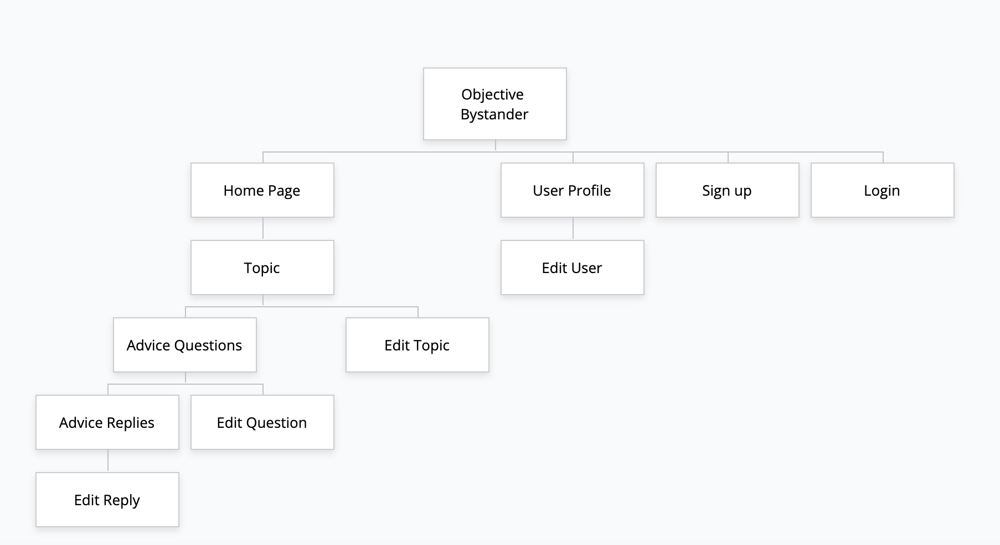

# T2A2 - Marketplace Project

## Status
Completed! Check out the links below to see the project live (objective bystander) or the code base (github)

## The Project can be found here:
- [Github](https://github.com/llausa/t2a2)
- [Objective Bystander](https://fierce-mesa-66953.herokuapp.com/) - Live website

# The Problem
**R7 Identification of the  _problem_  you are trying to solve by building this particular marketplace  _app_.**

When people ask for advice, they are ready to change. However, asking for advice can be complicated and we don't usually want to ask advice from the people around us.

Most of the times, useful advice comes from strangers who are not biased, have no connections to us and are giving us an objective viewpoint without adverse incentives against our long term gain.

**R8 Why is it a  _problem_  that needs solving?**
With the creation of the Internet, there is no at-scale solution that allows people to receive advice based on specific topics, from subject-matter experts.

A lot of knowledgeable people in the world are not sharing their thoughts and perspectives and now it's possible for anyone to unlock that information.

It can now be stored on the Internet and shared with anyone who is asking.

An extension of this product would be to allow advice givers to charge a monthly subscription for their advice (while the platform takes a small cut), with limits placed by the advice giver on how many questions/advice requests can be made by premium users of the specific advice giver.

## The Solution

R11 Description of your marketplace  _app_  (website), including:
- Purpose
	- The purpose of this application is to provide a two-way marketplace that connects subject-matter experts offering advice on specific topics with individuals seeking advice on those topics or on general topics (Health, Wealth, Relationships and General).

- Functionality / features
	- Users will be able to create accounts on the platform and choose to be Advice Givers (Advisors) or Advice Takers (Advisees).
	- Advice Takers (Advisees) will be able to ask questions from specific topics (managed by subject matter experts) or post Advice requests on a one of the four general advice page topics (health, wealth, relationships, general)
	- Advice Givers (Advisors) will be able to respond to questions under the four main topics as well as on topics they have created and feel like they can give advice on. Only the Advisor owners of each topic will be able to answer questions on their topics. Advisees can choose to post questions under these Advisor topics if they feel like the Advisor can help them.

- Sitemap
	- 

- Screenshots of final version
	- [Screenshot 1](docs/screenshot_1.png)
	- [Screenshot 2](docs/screenshot_2.png)
	- [Screenshot 3](docs/screenshot_3.png)
	- [Screenshot 4](docs/screenshot_4.png)
	- [Screenshot 5](docs/screenshot_5.png)

- Target audience
	The primary target audience is anyone looking for specific, advice on Health, Wealth or Relationships based on the experience Advice Givers may have.

	The other primary target audience is advice givers who feel they can contribute with advice on specific topics under the Health, Wealth and Relationship umbrellas. The idea behind targeting these users is to unlock their experiences at scale and reachable by anyone with an Internet connection.

- Tech stack (e.g. html, css, deployment platform, etc)
	[Ruby on Rails](https://rubyonrails.org/) for Backend
	[PostgresQL](https://www.postgresql.org/) for the Database
	[Bulma](https://bulma.io/) for Frontend
	[Github](https://github.com/) for Version Control
	[Github Projects](https://help.github.com/en/github/managing-your-work-on-github/about-project-boards) for planning and task assignment
	[Heroku](https://www.heroku.com/) for Production Hosting

## User Stories
R12 User stories for your  _app_

User Stories can be found [here](https://github.com/llausa/t2a2/projects/1).

## Wireframes
R13 Wireframes for your  _app_

## ERD
R14 An ERD for your  _app_

## High-Level Components
R15 Explain the different high-level components (abstractions) in your  _app_

As a marketplace application, Users (advice givers and takers) interact with each other through Advice and its replies.

An advice taker (aka requesting advice) can post a request for Advice on one of the main advice pages (Health, Wealth, Relationships, General) or directly ask an Advisor (advice giver) for advice on one of the three specialties where they are subject matter experts.

An Advisor will be able to list out up to 3 specialities they have and which advice takers can request advice for.

A User, when creating an account will have to choose to be either an Advisor or an Advice Taker. These options are mutually exclusive. User usernames will be randomly generated automatically when an account is made and users will use their emails for authentication.

## Third Party Services

R16 Detail any third party services that your  _app_  will use

- Devise
- Rolify
- Couldinary
- Ask Matt about Authorisation (does authorisation mean rolify? can it be custom made?)

## Project Models
R17 Describe your projects  _models_  in terms of the relationships (active record associations) they have with each other

User, Specialty, Advice and Replies

The User model is the primary model in the application. It holds relationships with nearly every other model, depending on the role of the User.
A User will have either an _Advisor_ or _Advice Taker_ role and these will be mutually exclusive. The User model has a one-to-many relationship with the Specialty model - meaning that one User object can have many specialties, but this will be capped at 3 specialties.
The Specialty model is the schema for 3 subjects or topics that an Advisor can display on their profile and which Advice Takers can request advice on specifically. Only the specialty (a specialty will be unique) owner will be able to answer any advice requests against the specialty object.
The User model can have many instances of Advice (Questions) and many instances of the Replies model.

Due to the roles in the application the Advice model is only connected to the Advice Taker role and the Replies model is only connected to the Advisor model.

The Advice model can have many replies while a Reply model instance belongs to one Advice model instance.

## DB Relations/Schema
R18 Discuss the database relations to be implemented in your application

R19 Provide your database schema design

## Task Allocation
R20 Describe the way tasks are allocated and tracked in your project
